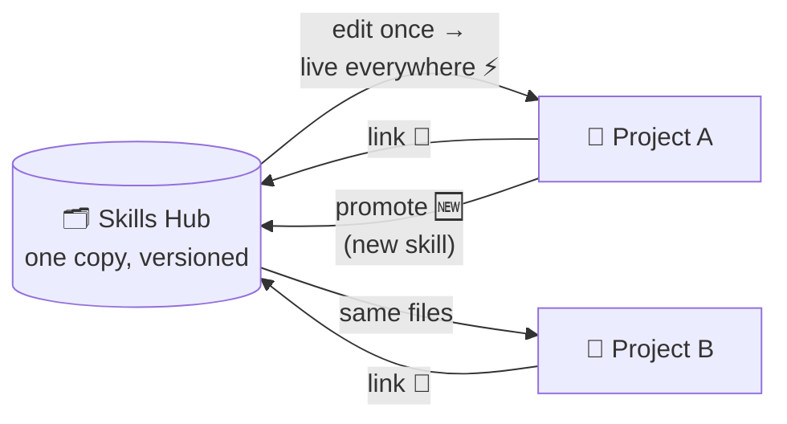

# Skills Hub 🧰

One home for all your agent skills. Projects borrow them by symlink, so a
skill exists once — not once per project, each copy a little different, all
of them quietly growing apart. If you have ever grep'd your workspaces for
`SKILL.md`, you know the horror. 😱

The fix is boring and effective: edit a linked skill, and every project
using it has the change immediately. Versioned, shared, done.

The hub is client-independent — a skill is just a directory with a
`SKILL.md`. Zoo Code (formerly Roo Code) is the first client; its links land
in `.roo/skills/`. OpenCode is the likely next one, and supporting it means
pointing at the same directories, not forking the hub.

## How it works 🔁



- **Link down:** a project lists what it needs in `.roo/skills.yml`;
  `skill-repo link` turns each entry into a symlink. The lockfile records
  which exact hub state you got.
- **Edits are instant:** a linked skill *is* the hub file. Change it in one
  project, it changes everywhere — then commit in the hub repo so the
  history keeps up.
- **Promote up:** a skill that was born (or still lives) as a local copy in
  a project? `promote` moves it into the hub, scans it for secrets and
  stray personal data, and stages it for commit.

You will rarely type any of this yourself. The global `skill-hub-handling`
skill teaches your agent the whole loop — search, link, edit-through,
promote, review — including the checklist it must run before promoting
across a trust boundary. You say "we need a data-table skill here" or
"push this one back to the hub", the agent drives. 🤖

| Command | Purpose |
|---|---|
| `search <term>` | find skills across all registered sources |
| `link [--prune] [--force]` | manifest → symlinks + lockfile (idempotent) |
| `promote [--force] <ref\|path> <source>/<category>` | move a skill into a content repo, scan + stage it — commit is yours |
| `where [<id>] [--prune]` | reverse lookup: which projects link a skill |
| `list` / `verify` | this project's links, drift, frontmatter sanity |
| `setup` / `update` / `add-remote` | hub bootstrap, ff-only pulls, register external collections |

## Setup 🚀

```bash
git clone <hub-url> ~/workspaces/skill-hub
cd ~/workspaces/skill-hub
./bin/skill-repo setup      # scaffolds personal/ + teams/evoya/, writes sources.yml,
                            # installs the global skill-hub-handling skill. Idempotent.
```

Per project, commit a manifest and link once:

```yaml
# <project>/.roo/skills.yml  (commit this file)
source: evoya                # optional default for unqualified entries
categories:
  - evoya/saas-pegasus       # link a whole category
skills:
  - data-table               # single skill (must be unique, or qualify)
  - personal/design/ui-demo  # source-qualified
exclude:
  - seo/seo-drift            # subtract from the selection
```

```bash
~/workspaces/skill-hub/bin/skill-repo link
```

Recommended per-project `.gitignore`: `.roo/skills/` and `.roo/skills.lock`
(links and lockfile are machine state; the manifest is the source of truth).

## Layout 📐

```
skill-hub/                    # this repo (bootstrap: docs, CLI, templates)
├── bin/skill-repo            # the CLI (bash, no dependencies)
├── meta/skill-hub-handling/  # the ONE global skill (symlinked into ~/.roo/skills)
├── sources.template.yml      # registry template
├── sources.yml               # machine-local registry (gitignored)
├── personal/                 # your private skills repo (gitignored here, own git)
├── teams/<team>/             # one shared skills repo per team (gitignored here)
└── external/<collection>/    # clones of third-party skill repos (gitignored)
```

Content repos are independent git repositories, deliberately invisible to
this one. Skills live at `skills/<category>/<skill>/SKILL.md`; the scanner
also handles foreign layouts for external collections.

## Trust rules 🛡️

- `personal/` never leaves your machine unless you give it a private remote.
- `teams/<team>/` is shared via that team's own remote. Anything crossing
  personal → team passes a review first: secrets, real emails, company
  terms, machine-specific paths. The promote checklist in
  `skill-hub-handling` is the control; the agent operating it owns that
  check.
- `external/*` is untrusted prompt content. Bulk-linking from it is
  refused; individual skills only, and only after a human said yes.

## One warning worth its own heading ⚠️

Do not run `git clean -fdX` in this repo. The content repos live in
gitignored paths, and that command will delete them without asking.
Recovery is possible only via remotes and backups — better to never need
either.
