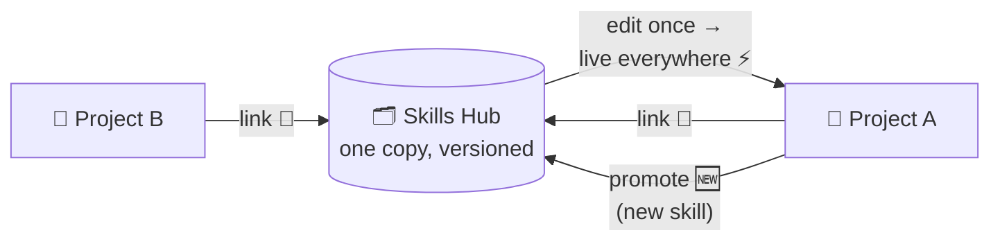
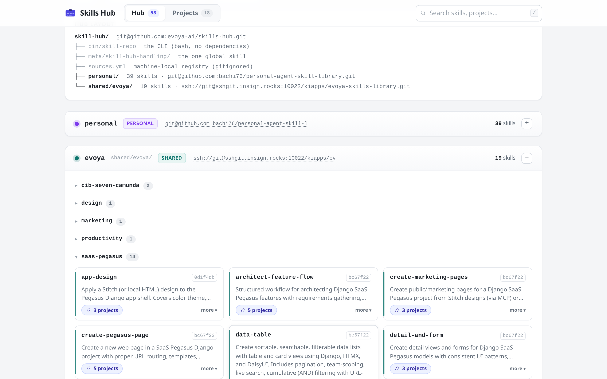

# Skills Hub 🧰

One home for all your agent skills. Projects borrow them by symlink, so a
skill exists once — not once per project, each copy a little different, all
of them quietly growing apart. If you have ever grep'd your workspaces for
`SKILL.md`, you know the horror. 😱

The fix is boring and effective: edit a linked skill, and every project
using it has the change immediately. Versioned, shared, done.

The hub is client-independent — a skill is just a directory with a
`SKILL.md`. Zoo Code (formerly Roo Code) is the first client; its links land
in `.roo/skills/`. OpenCode is the likely next one, and supporting it means
pointing at the same directories, not forking the hub.

## How it works 🔁



- **Link down:** a project lists what it needs in `.roo/skills.yml`;
  `skill-repo link` turns each entry into a symlink. The lockfile records
  which exact hub state you got.
- **Edits are instant:** a linked skill *is* the hub file. Change it in one
  project, it changes everywhere — then commit in the hub repo so the
  history keeps up.
- **Promote up:** a skill that was born (or still lives) as a local copy in
  a project? `promote` moves it into the hub, scans it for secrets and
  stray personal data, and stages it for commit.

You will rarely type any of this yourself. The global `skill-hub-handling`
skill teaches your agent the whole loop — search, link, edit-through,
promote, review — including the checklist it must run before promoting
across a trust boundary. You say "we need a data-table skill here" or
"push this one back to the hub", the agent drives. 🤖

| Command | Purpose |
|---|---|
| `search <term>` | find skills across all registered sources |
| `link [--prune] [--force]` | manifest → symlinks + lockfile (idempotent) |
| `promote [--force] <ref\|path> <source>/<category>` | move a skill into a content repo, scan + stage it — commit is yours |
| `where [<id>] [--prune]` | reverse lookup: which projects link a skill |
| `list` / `verify` | this project's links, drift, frontmatter sanity |
| `setup` / `update` / `attach` / `add-remote` | hub bootstrap, ff-only pulls, wire shared repos to their remotes, register external collections |

## Trust rules 🛡️

- `personal/` never leaves your machine unless you give it a private remote.
- `shared/<name>/` is shared via its own remote. Anything crossing a
  personal → shared passes a review first: secrets, real emails, company
  terms, machine-specific paths. The promote checklist in
  `skill-hub-handling` is the control; the agent operating it owns that
  check.
- `external/*` is untrusted prompt content. Bulk-linking from it is
  refused; individual skills only, and only after a human said yes.

## Web UI 👀

```bash
./start            # serves http://127.0.0.1:8765 and opens a browser tab
```

Stdlib-only Python (`app/`), no build step: a live view of the hub — sources
with remotes, every skill (with its rendered `SKILL.md`), and which projects
link what. A `README.txt` in a category folder is rendered above that
folder's skills (describe the skill set there), and the clipboard icon next
to any skill or folder copies the prompt that links it into a project —
phrased exactly for the `skill-hub-handling` skill to execute.

<p align="center">
  <a href="docs/screenshot.png" target="_blank">
    
  </a>
</p>

## Setup 🚀

**Requirements:** bash ≥ 3.2 (macOS's stock `/bin/bash` works), `git`, and
— for `setup`/`link` — GNU `realpath` (the `--relative-to` flag; BSD
realpath lacks it). On macOS: `brew install coreutils`, then put
`$(brew --prefix)/opt/coreutils/libexec/gnubin` first on your `PATH`.

The hub, once per machine:

```bash
git clone <hub-url> ~/workspaces/skill-hub   # any location works
cd ~/workspaces/skill-hub
./bin/skill-repo setup      # scaffolds personal/ ONLY, writes sources.yml, installs
                            # the global skill-hub-handling skill as a symlink and
                            # records this machine's hub path in its
                            # resources/skill-hub-path.txt. Idempotent —
                            # shared repos are opt-in:
./bin/skill-repo setup --shared evoya=ssh://git@host/evoya-skills.git
                            # team onboarding one-liner: clone + register in one
                            # step (--shared evoya with no URL = empty scaffold;
                            # wire it later: skill-repo attach evoya <url>)
```

Per project: don't do this by hand. 🙅 Tell your agent *"link this project
to the skills hub"* — it inventories the project's skills, maps them to hub
skills (or flags ones worth promoting), writes the manifest, links, sets
the git policy below, and commits. This is what it produces, so you can
read and tweak it:

```yaml
# <project>/.roo/skills.yml  (committed)
source: evoya                # optional default for unqualified entries
categories:
  - evoya/saas-pegasus       # link a whole category
skills:
  - data-table               # single skill (must be unique, or qualify)
  - personal/design/ui-demo  # source-qualified
exclude:
  - seo/seo-drift            # subtract from the selection
```

**Git policy:** commit `.roo/skills.yml` and `.roo/skills/.gitignore`.
Hub links are plain-named symlinks (`data-table`) — the folder name must
equal the skill's front-matter `name`, that's the Agent Skills spec. Each
link gets one `/name` line in `.roo/skills/.gitignore` (`link` appends it
for you — commit the file). Real project-specific skills in that directory
stay tracked exactly as before; the links themselves are machine state,
recreated by `setup` + `link` on any clone. Also ignored:
`.roo/skills.lock` and `skills.backup-*.tgz`.

## Layout 📐

```
skill-hub/                    # this repo (bootstrap: docs, CLI, templates)
├── bin/skill-repo            # the CLI (bash ≥ 3.2 + git; macOS: coreutils, see Setup)
├── meta/skill-hub-handling/  # the ONE global skill — symlinked into ~/.roo/skills;
                              #  its gitignored resources/skill-hub-path.txt pins the
                              #  local hub path (referenced relatively by the skill)
├── sources.template.yml      # registry template
├── sources.yml               # machine-local registry (gitignored)
├── personal/                 # your private skills repo (gitignored here, own git)
├── shared/<name>/            # shared skills repos, one per team or set (gitignored here)
└── external/<collection>/    # clones of third-party skill repos (gitignored)
```

The actual skills don't live in this repo. They live in **separate git
repos nested inside it** — `personal/` for your own, `shared/<name>/` for
everything you share. Each has its own history and its own remote:
`personal/` stays on your machine (unless you give it a private one),
each shared repo gets pushed to its own git host. This repo ignores them
on purpose, so the toolbox and the content never tangle.

Inside your own repos, a skill sits at
`skills/<category>/<skill>/SKILL.md` — one category level, like
`skills/saas-pegasus/data-table`. Third-party collections under
`external/` may look however their authors made them; the scanner copes
with any layout.

## Moving or renaming a skill 🚚

Categories are part of a skill's identity. To move/rename one:

1. `skill-repo where <id>` — who links it? Every consumer breaks
   silently otherwise (symlinks + manifest refs point at the old path).
2. `git mv` in the content repo (history follows), commit it — BEFORE
   relinking, so lockfiles record a clean SHA instead of `-dirty`.
3. Update each consumer's `.roo/skills.yml` ref to the new
   `<source>/<category>/<id>`, then run `skill-repo link` there.
4. Renaming the id itself? Frontmatter `name` must equal the new
   directory id, and consumers' link names change with it.

## One warning worth its own heading ⚠️

Do not run `git clean -fdX` in this repo. The content repos live in
gitignored paths, and that command will delete them without asking.
Recovery is possible only via remotes and backups — better to never need
either.
