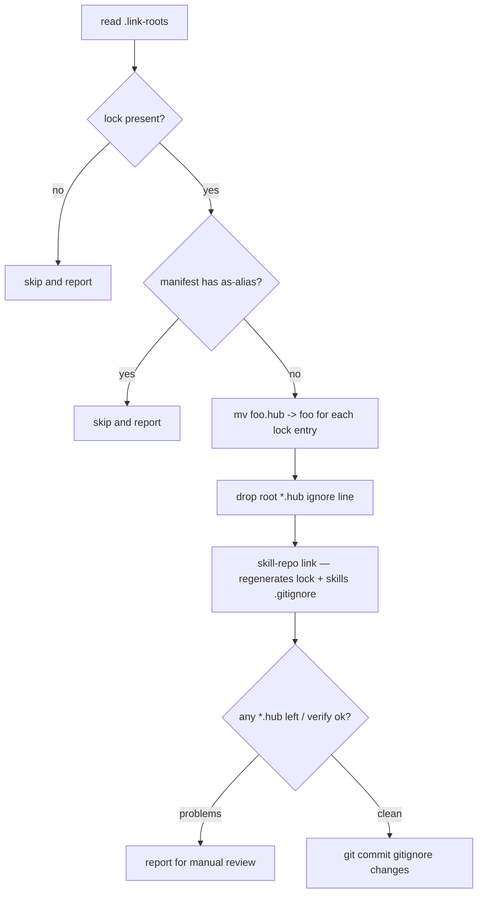

# Spec: Plain link names + managed skills-dir .gitignore (link policy v4)

Date: 2026-09-15
Status: proposed
Supersedes: link policy v3 (`.hub` marker suffix, see `migration/HANDOFF.md` item 20)

## 1. Problem

The Agent Skills spec requires the skill folder name to equal the front-matter
`name` exactly (lowercase, digits, hyphens — no dots). Policy v3 names hub
links `<id>.hub` (e.g. `data-table.hub` while front matter says
`name: data-table`), so **agents do not recognize linked skills as valid
skills**. Current state: 18 consumer projects, 112 `.hub` links, zero aliased
links (verified via lockfiles — no `aliased: true` anywhere).

## 2. Goals

1. Hub links live at `.roo/skills/<id>` — folder name == front-matter `name`.
2. Git keeps ignoring the links, now via a `.gitignore` **inside the skills
   parent folder** (`.roo/skills/.gitignore`), one plain entry per link.
3. Existing projects keep the exact same set of working links — migration
   **renames** (`mv foo.hub foo`), never prunes/re-resolves away skills.
4. KISS: no BEGIN/END markers, no block rewriting. The gitignore gets plain
   `/name` lines; `link` only ever appends missing lines.

## 3. Non-goals

- No changes to manifest format (`.roo/skills.yml`) or lockfile location.
- No alias support going forward (see §5.5 — feature is removed; nothing in
  the wild uses it).
- No auto-removal of stale gitignore entries (accepted trade-off, §5.3).

## 4. Policy v4 — target state

```text
project/
├── .roo/
│   ├── skills.yml            # manifest, committed (unchanged)
│   ├── skills.lock           # lockfile, ignored, machine state (unchanged role)
│   └── skills/
│       ├── .gitignore        # committed — one "/<id>" line per hub link
│       ├── data-table -> ../../../skill-hub/...   # plain name symlink
│       └── <local-skill>/    # real dirs stay tracked exactly as before
```

`.roo/skills/.gitignore` format:

```gitignore
# hub links — managed by skill-repo link
/data-table
/ui-demo
```

Rules:

- **Entry format: `/<id>`** — leading slash anchors to `.roo/skills/`; **no
  trailing slash** (gitignore trailing-slash patterns match directories only;
  the links are symlinks, which git lstats as `S_IFLNK`, not dirs).
- The `#` header line is written **once**, when the file is created — it
  doubles as the provenance marker: with our header first, `link`
  **reconciles** the `/name` entries (stale removed, current re-added);
  without it (user-preexisting file) `link` is add-only and removes nothing.
- Committed in the consumer repo (same sharing story as v3's single root line).

## 5. CLI changes — `bin/skill-repo`

### 5.1 `resolve()` — drop the suffix

- Delete `ln="$ln.hub"` (currently line ~254). Link name = skill id (or alias,
  but see §5.5).

### 5.2 `cmd_link()` — replace `link_ignore_pattern`

- Keep `mkdir -p .roo/skills`, symlink creation, collision handling, and the
  prune loop exactly as they are (the prune loop is suffix-independent: it
  removes hub-pointing symlinks not in the current result set).
- `aliased` computation (currently `[ "${lnk%.hub}" != "$(basename "$path")" ]`)
  becomes `[ "$lnk" != "$(basename "$path")" ]` — and disappears entirely once
  aliases are removed (§5.5). Stop writing the `aliased:` field into the lock;
  `app/scanner.py:parse_lock()` tolerates missing keys, no scanner change
  needed.
- Replace the call to `link_ignore_pattern` with `link_gitignore_entries`:

```bash
link_gitignore_entries() { # append missing '/<id>' lines for linked skills
  git rev-parse --show-toplevel > /dev/null 2>&1 || return 0   # no repo: skip
  local gi=.roo/skills/.gitignore name
  [ -f "$gi" ] || printf '# hub links — managed by skill-repo link\n' > "$gi"
  while IFS="$FS" read -r lnk _src _cat _path; do
    [ -n "${lnk:-}" ] || continue
    grep -qxF "/$lnk" "$gi" || printf '/%s\n' "$lnk" >> "$gi"
  done <<< "$RESULT"
}
```

- Note the destination dir is fixed (`.roo/skills/`); no root-relative path
  computation anymore.

### 5.3 Reconcile-with-provenance semantics (KISS decision)

- The single header comment replaces the BEGIN/END marker pair. When it is
  the file's first line, plain `^/[a-z0-9][a-z0-9-]*$` entries are ours:
  `link` rewrites that set to exactly the current links. Non-matching lines
  (comments, user rules, wider names) pass through untouched — we can never
  eat a possibly-user line.
- A user-preexisting file without our header: add-only (dedup via exact-line
  `grep -qxF`), nothing ever removed.

### 5.4 `cmd_where()` — keep dual matching

- The awk match `$0 == n ":" || $0 == n ".hub:"` stays **unchanged** so
  `where` keeps working for any consumer that has not yet run the migration.

### 5.5 Aliases — remove the feature

- Spec compliance means folder name == front-matter `name`; an alias link name
  can never comply. Zero aliases exist today.
- In `resolve()`, drop the `*" as "*` case and `ALIAS_TMP` handling. If a
  manifest entry contains ` as `, die with a clear message:
  `aliases are no longer supported: skill folder name must equal front-matter name (spec)`.
- Reword the duplicate-name conflict (currently suggests "add an 'as' alias")
  to: `skill '<ln>' selected twice — names must be unique in .roo/skills (folder == front-matter name)`.

### 5.6 `cmd_verify()` — enforce the invariant

- For every skill in the index: front-matter `name` != dir id is currently a
  warning — **keep as warning** for unlinked index entries (external
  collections may not comply), but **hard-fail** when the skill is part of the
  linked set (`$RESULT`), since that's the spec-critical case.
- Add a charset warning for ids not matching `^[a-z0-9][a-z0-9-]*$` (dots in
  ids would produce non-compliant link names; `attach` already enforces this
  style for source names — same regex family).

## 6. Docs & app touch-ups

- `README.md` git-policy paragraph (~line 116): describe plain link names +
  `.roo/skills/.gitignore` (committed, `link` maintains it), drop `.hub`
  wording. Also the "Moving or renaming" section stays valid as-is.
- `meta/skill-hub-handling/SKILL.md` (~line 58): same policy rewrite.
- `app/data.py` comments (lines 6–7, 313–314) mention `.hub` — reword to
  symlink-based distinction. No functional change (`app/scanner.py` already
  detects links by `is_symlink()` and skips dotfiles, so `.gitignore` in the
  skills dir is invisible to the UI).

## 7. Tests — `tests/test-skill-repo.sh`

Add cases (reuse `new_hub`/`seed_remote`/`run_cli` helpers):

1. Link produces a **plain-name** symlink: `.roo/skills/data-table` (no
   `.hub`), lock key is `data-table:`.
2. `.roo/skills/.gitignore` exists, contains exactly `/data-table`; header
   line present once; relinking does not duplicate entries.
3. Root `.gitignore` gets **no** new line (old behavior gone).
4. Manifest entry with ` as ` → link exits non-zero, message mentions
   "aliases".
5. `verify` fails when a linked skill's front-matter `name` != dir id.
6. Local (non-symlink) skill dirs remain untouched and unignored.

## 8. Migration — `migration/plain-name-rollout.sh`

Modeled on `migration/hub-suffix-rollout.sh`. Iterates the 18 roots from
`.link-roots`. Per project (skip + report if lock missing):

1. **Pre-flight:** manifest contains ` as ` → skip, report (none expected —
   verified). Work tree state: only touch the files listed below; user-dirty
   files untouched (v3 rollout precedent).
2. **Rename:** parse `.roo/skills.lock`; for each entry, `mv
   .roo/skills/<key> .roo/skills/<basename-of-path>` (for non-aliased links
   this is exactly stripping `.hub`). If the target name already exists and
   is not the same symlink → report conflict, skip that entry. Never delete.
3. **Old ignore line:** remove the exact line `<rel>/*.hub` (and the
   preceding `# skills hub links (marker suffix)` comment, if present) from
   the **root** `.gitignore`; no-op if absent.
4. **Relink:** run `skill-repo link` (new version) — regenerates the lock
   with plain names, repoints symlinks (`ln -sfn` is idempotent), appends
   `.roo/skills/.gitignore` entries.
5. **Post-check:** no `*.hub` symlinks remain in `.roo/skills`; `verify`
   passes; any hub-pointing symlink absent from the new lock is reported for
   manual review (manifest drift guard — not silently dropped).
6. **Commit** (project repo, only if something changed): `.gitignore` +
   `.roo/skills/.gitignore`. Message:
   `skills: plain link names + .roo/skills/.gitignore (hub policy v4)`.



**Rollback:** links are machine state — worst case rerun `skill-repo link`
with the old or new CLI. The committed `.gitignore` changes revert via normal
`git revert` in each consumer.

## 9. Acceptance criteria

1. `find <each consumer>/.roo/skills -maxdepth 1 -name '*.hub'` → empty.
2. Every hub-pointing symlink's basename == front-matter `name` of its
   target's `SKILL.md` (spot-check via `verify`, now enforcing it).
3. Same link count per project as before the rollout (lock diff: keys
   renamed, paths identical).
4. `git status` clean in every consumer after the rollout commit (no
   untracked link dirs, no staged leftovers).
5. `skill-repo where <id>` still resolves consumers (dual lock-key matching).
6. New test suite green (`bash tests/test-skill-repo.sh`).

## 10. Implementation order

1. `bin/skill-repo` changes (§5) + tests (§7) — land together.
2. Docs (§6).
3. Rollout script (§8), dry-run report first, then execute for the 18
   consumers.
4. Final verification per §9; append a HANDOFF.md entry documenting policy v4.
